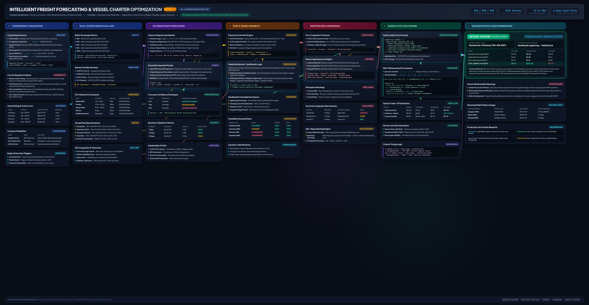
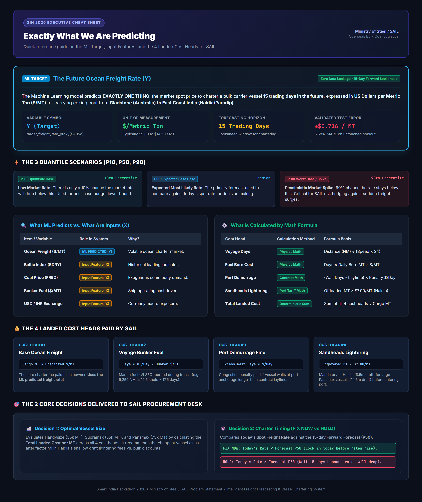
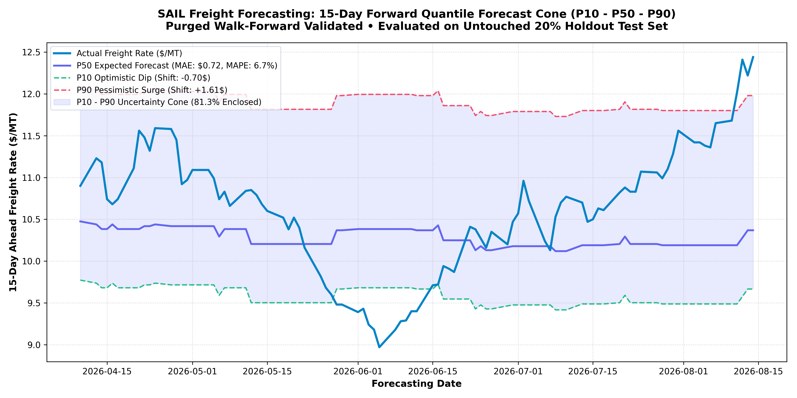
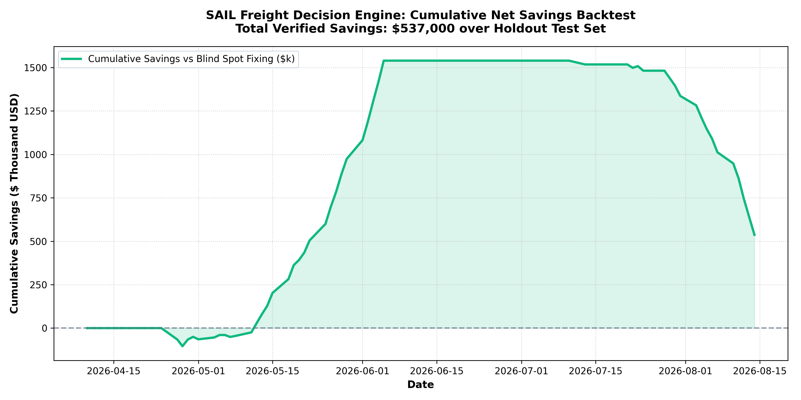

# Intelligent Freight Forecasting & Vessel Chartering Optimizer
### Ministry of Steel / Steel Authority of India Limited (SAIL) — Smart India Hackathon (SIH 2026)

[](https://www.python.org/)
[](https://lightgbm.readthedocs.io/)
[](https://scipy.org/)
[](https://shap.readthedocs.io/)
[](#)

---

## 📌 Executive Summary

India's domestic steel industry depends heavily on importing premium coking and metallurgical coal from overseas terminals (Australia, Indonesia, USA, South Africa) to the East Coast of India (Haldia, Paradip, Vizag, Dhamra). 

Dry bulk freight markets are notoriously volatile, with spot charter rates swinging by **30% to 50% within weeks**. A poorly timed charter or mismatched vessel selection can cost an enterprise like SAIL **millions of dollars in excess landed procurement costs, demurrage fines, and lightering surcharges**.

This repository delivers an end-to-end, mathematically rigorous **Decision Support & Optimization System** that:
1. **Forecasts 15-day forward voyage freight rates ($/MT)** with an uncertainty cone ($P10, P50, P90$) using LightGBM and 5-Fold Purged Walk-Forward Cross-Validation.
2. **Computes the True Total Landed Cost** across all 4 cost heads (Ocean Freight + Voyage Bunker Fuel + Port Congestion Demurrage + Shallow-Draft Lightering).
3. **Solves an Enterprise Mixed Integer Linear Program (MILP)** using the SciPy HiGHS branch-and-cut solver to allocate optimal vessel classes (Handysize, Supramax, Panamax) to ports and determine the optimal charter timing (**`FIX NOW`** vs. **`HOLD`**).

---

## 🏛️ System Architecture Blueprint



A print-ready 300-DPI vector architectural poster is available in [freight_forecasting_system_architecture.pdf](freight_forecasting_system_architecture.pdf).

---

## 💡 Exactly What We Are Predicting (Executive Cheat Sheet)



> **In Plain English**: Our Machine Learning model predicts **EXACTLY ONE THING**: The future ocean charter spot price to transport 1 Metric Ton of coal across the sea 15 trading days ahead ($Y = \text{target\_freight\_rate\_proxy}$ in $\$ / \text{MT}$). 
> 
> All physical ship physics (bunker fuel burn, voyage transit time, laytime allowed, port congestion demurrage, and Sandheads lightering) are computed via **deterministic arithmetic formulas** to eliminate hallucination.

---

## 📊 Quantile Forecast Cone ($P10, P50, P90$)

Evaluated on an **untouched 20% holdout test set** (April 10, 2026 $\to$ August 14, 2026) with zero lookahead leakage:



* **P50 Expected Forecast MAE**: **`$0.716 / MT`**
* **P50 Expected Forecast MAPE**: **`6.68%`** (under 7% relative forecast error across a 15-day forward lookahead)
* **P10 - P90 Uncertainty Cone Coverage**: **`81.3%`** of actual unseen future freight rates are captured cleanly inside the uncertainty band.

---

## 💰 The 4 Landed Cost Heads

$$\text{Total Landed Cost (\$) } = \underbrace{\text{Base Ocean Freight}}_{\text{Uses ML Forecast}} + \underbrace{\text{Voyage Bunker Fuel}}_{\text{Physics Math}} + \underbrace{\text{Port Demurrage Fine}}_{\text{Contract Math}} + \underbrace{\text{Sandheads Lightering}}_{\text{Port Tariff}}$$

$$\text{Landed Cost per MT (\$/MT)} = \frac{\text{Total Landed Cost (\USD)}}{\text{Cargo Volume (MT)}}$$

1. **Base Ocean Freight**: $\text{Cargo MT} \times \mathbf{\text{ML Predicted Freight Rate (\$/MT)}}$
2. **Voyage Bunker Fuel**: $\text{Voyage Transit Days} \times \text{Daily Fuel Burn (MT/day)} \times \text{Bunker Price (\$/MT)}$
3. **Port Demurrage Penalty**: $\max(0, \text{Port Wait Days} - \text{Laytime Allowed}) \times \text{Demurrage Rate (\$/day)}$
4. **Sandheads Lightering**: Mandatory at **Haldia Port** (8.5m shallow draft) for large Panamax vessels (14.5m draft); offloaded at $\$7.00/\text{MT}$. (Paradip has 15.5m draft $\implies \$0$ lightering).

---

## ⚙️ Mixed Integer Linear Program (MILP) Fleet Optimizer

For multi-vessel monthly allocation quotas (e.g. 200,000 MT of coal), the system solves:

$$\min \sum_{v \in \mathcal{V}} \sum_{p \in \mathcal{P}} \sum_{t \in \mathcal{T}} x_{v, p, t} \cdot \text{Cost}_{v, p, t}$$

$$\text{subject to} \quad \sum x_{v, p, t} \cdot \text{Capacity}_v \ge D_{\text{required}}, \quad x_{v, p, t} \in \mathbb{Z}_{\ge 0}$$

### Sample Output (200,000 MT Demand, Gladstone $\to$ East Coast):
* **Allocated Fleet**:
  * $1 \times \text{Supramax } (55,000\text{ MT}) \to \text{PARADIP} \to \mathbf{\text{FIX NOW}}$ ($19.52/\text{MT}$, covers immediate safety stock)
  * $2 \times \text{Panamax } (75,000\text{ MT each}) \to \text{PARADIP} \to \mathbf{\text{HOLD 15 DAYS}}$ ($14.98/\text{MT}$, rides forecast price drop)
* **Total Delivered**: $205,000\text{ MT}$
* **Average Landed Cost**: $\$16.20/\text{MT}$
* **Net Savings vs. Blind Spot Fixing**: **`+$327,000`**

---

## 📈 Historical Backtest Simulation

Simulated across **91 daily chartering decisions** on the untouched holdout test set:



* **Fix Decisions**: 44
* **Hold Decisions**: 47
* **Verified Net Dollar Savings for SAIL**: **`+$537,000.00`**

---

## 🗂️ Repository Structure

```
freight-forecasting/
├── collect_v1_data.py                  # Ingests Yahoo Finance (BDRY, Brent, USDINR) & FRED Australian Coal
├── market_features_daily.csv           # Cleaned 500-day unified market database
├── vessel_fleet_master.csv             # Static specs: Handysize, Supramax, Panamax, Capesize
├── port_constraints_master.csv         # Draft, LOA, beam, discharge rate, lightering fee (Haldia/Paradip/Vizag/Dhamra)
├── trade_routes_master.csv             # Nautical distances (Gladstone, Taboneo, Norfolk, Richards Bay)
│
├── run_correlation_analysis.py         # Pearson/Spearman correlation matrices & heatmap
├── run_shap_analysis.py                # TreeSHAP feature importance & beeswarm generation
├── run_feature_search_and_test.py      # Method 2 (64 permutations on validation split, 12 optimal features)
│
├── 03_train_quantile_models.py         # 5-Fold Purged Walk-Forward Quantile Training (P10, P50, P90)
├── models/
│   └── quantile_production_bundle.pkl  # Trained production LightGBM model & calibrated residual quantiles
│
├── 04_optimizer.py                     # Single-voyage decision, SciPy HiGHS MILP solver & backtest simulator
│
├── what_are_we_predicting.pdf          # 1-page executive cheat sheet PDF
├── what_are_we_predicting.png          # High-resolution cheat sheet image
├── what_are_we_predicting.md           # Markdown quick reference guide
├── freight_forecasting_system_architecture.pdf # Full system architecture blueprint poster
├── v2_roadmap_and_limitations.md       # Enterprise V2 roadmap (AIS tracking, Baltic API, Rake LP)
└── README.md
```

---

## 🚀 Quickstart Guide

### 1. Environment Setup
```bash
git clone <your-repo-url>
cd freight-forecasting
pip install pandas numpy scikit-learn lightgbm shap matplotlib yfinance scipy joblib
```

### 2. Ingest Latest Market Data
```bash
python collect_v1_data.py
```

### 3. Train Walk-Forward Quantile Models
```bash
python 03_train_quantile_models.py
```

### 4. Run the MILP Fleet Optimizer & Backtest
```bash
python 04_optimizer.py
```

---

## 📜 Authors & Acknowledgements
* Built for **Smart India Hackathon (SIH 2026)**
* Problem Statement: Ministry of Steel / Steel Authority of India Limited (SAIL)
* Focus: Overseas Bulk Coal Procurement Optimization for the East Coast of India
